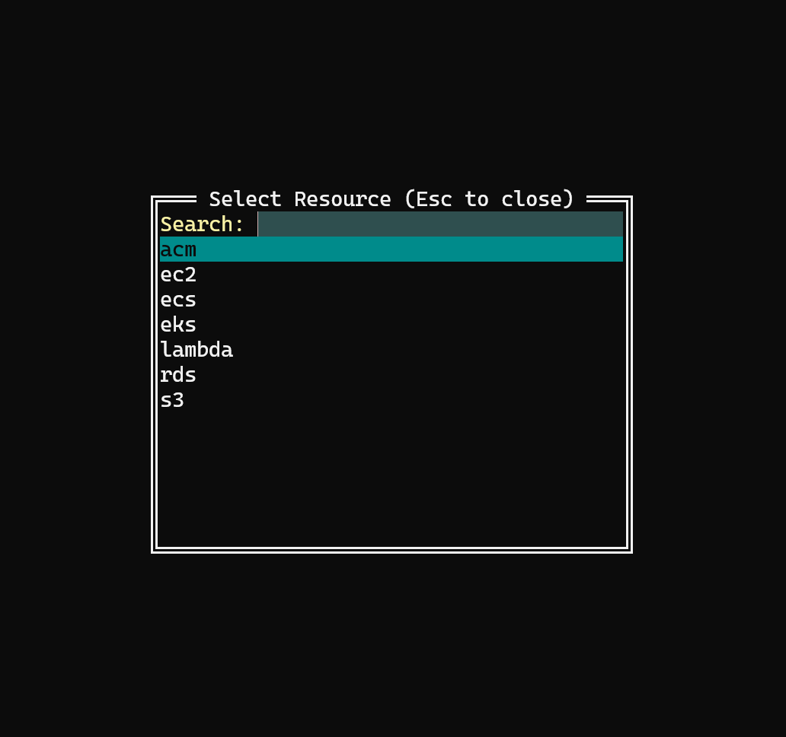
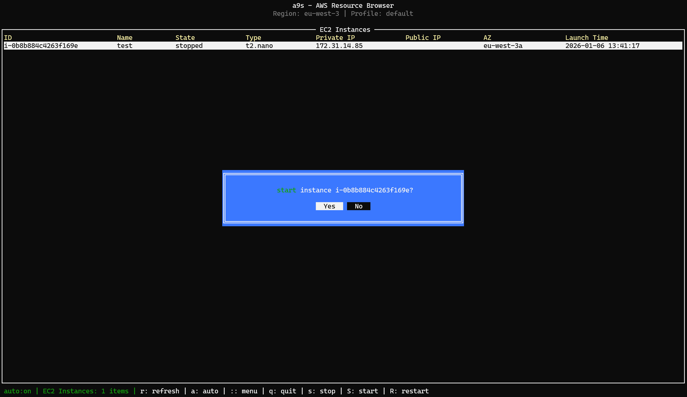

# a9s - Terminal-UI for AWS

[](https://opensource.org/licenses/MIT) [](https://pkg.go.dev/github.com/fallais/a9s) [](https://github.com/fallais/a9s/actions) [](https://goreportcard.com/report/github.com/fallais/a9s) [](https://coveralls.io/github/fallais/a9s?branch=main)

**a9s** provides a terminal UI to interact with your AWS resources, developed with **Go** and inspired by [k9s](https://github.com/derailed/k9s).

## Screenshots





## Features

- Auto refresh
- Easily select resources
- Switch profile
- Switch region
- S3 : Create, delete and drop (empty) buckets

## Installation

### Linux

```sh
curl -sL https://github.com/fallais/a9s/releases/download/v0.1.0/a9s_0.1.0_linux_arm64.tar.gz
tar -xf a9s_0.1.0_linux_arm64.tar.gz
sudo mv a9s /usr/local/bin/
```

### Windows

Download latest archive from the [Release page](https://github.com/fallais/a9s/releases)

Extract the binary into a specific folder

Add the binary in your PATH

## Resources

- ACM
- EC2
- ECS
- EKS
- Lambda
- RDS
- S3
- ECR
- KMS
- Secrets Manager
- DynamoDB
- Cloudfront
- Cognito